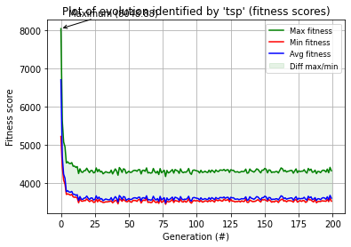

# MLG - Labo8: THE BURMAN TRAVELING SALESMAN PROBLEM


> **Auteur:** Chris Barros Henriques
>
> **Date:** 18.06.21
>
> HEIG-VD


## 6.1

Le problème qui nous est donné ici est celui du problème du voyageur de commerce. En se basant sur une liste de villes et leurs distances respectives, on souhaite déterminer quelle est la route qui permet de passer une seule fois dans chaque ville, minimisant le chemin parcouru et permettant à la fin de revenir à notre point de départ. Plus précisément, il nous est donné un ensemble de 14 paires de coordonnées GPS de villes du Myanmar et de déterminer quel est le chemin optimal résolvant le problème du voyageur de commerce. Il nous est de plus demandé de prendre en compte que les points se trouvent sur la Terre, une sphère, et donc que prendre la distance euclidienne comme métrique n'est pas une bonne idée. Pour cette raison, j'ai utilisé une librairie Python qui utilise la formule de Vincenty afin de calculer cette distance.

C'est un problème NP-complet mais son importance est grande dans le domaine des sciences informatiques et bien d'autres.


La solution proposée utilise un algorithme génétique. L'idée est de représenter les chemins que l'on effectue par une liste ordonnée de nombre de 1 à 14, chacun représentant l'indice d'une coordonnée GPS dans les tableaux fournis. Par exemple, `0 1 2 3 4 5 6 7 8 9 10 11 12 13` est un chemin possible. L'algorithme va ensuite calculer la distance totale parcourue et la retenir. Il va ensuite faire muter le chromosome (le chemin trouvé) afin de toujours minimiser la distance (par exemple le chemin `0 1 2 3 12 13 4 5 6 7 8 9 10 11` peut être une meilleure solution).

<div style="page-break-after: always; break-after: page;"></div>


## 6.2 Meilleur chemin 

Après de nombreuses itérations, j'ai trouvé le chemin: `9 8 10 0 1 7 12 6 5 11 13 2 3 4` qui représente 2635.73 kilomètres.

Il ne nous est pas possible de déterminer si ce chemin est le plus optimal, car comme le problème est NP-complet, il faudrait faire une liste exhaustive de tous les chemins pour le déterminer, ce qui est impossible au vu de la complexité du graphe. Une façon de trouver un bon résultat est de répéter l'expérience plusieurs fois, comme je l'ai fait.  


## 6.3 Fonction de fitness

Ma fonction de fitness est la suivante:

```python
def fitness(chromosome):
    nb_dupl = len(set(chromosome))
    score = 0.0
    for i in range(0, len(chromosome)-1):
        score += geopy.distance.distance((LAT[chromosome[i]], LON[chromosome[i]]), (LAT[chromosome[i+1]], LON[chromosome[i+1]])).km

    if len(chromosome) != nb_dupl:
        return - (score + 100000000000 * (len(chromosome) - nb_dupl))
    return -score
```


Afin de vérifier que l'algo ne puisse pas retourner un chemin à distance nulle (répéter le même point indéfiniment) ou qu'il puisse passer par plusieurs fois la même ville, je vérifie qu'il n'y ait pas de répétitions dans le chromosome fourni en calculant le nombre de villes dupliquées. Si c'est le cas, je pénalise fortement le score en prenant en compte le nombre de répétitions, sinon calcule normalement le score en n'additionnant que les distances entre chaque coordonée.

<div style="page-break-after: always; break-after: page;"></div>


## 6.4


## 6.5


<div style="page-break-after: always; break-after: page;"></div>


## 6.6 Plots





<div style="page-break-after: always; break-after: page;"></div>


## 6.7 Conclusion


