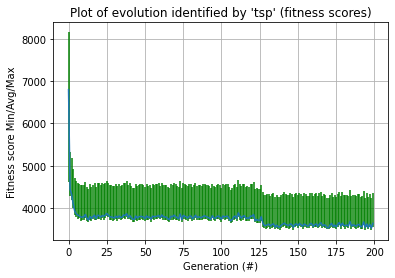

# MLG - Labo8: THE BURMAN TRAVELING SALESMAN PROBLEM


> **Auteur:** Chris Barros Henriques
>
> **Date:** 18.06.21
>
> HEIG-VD


## 6.1 Description du problème

Le problème qui nous est donné ici est celui du problème du voyageur de commerce. En se basant sur une liste de villes et leurs distances respectives, on souhaite déterminer quelle est la route qui permet de passer une seule fois dans chaque ville, minimisant le chemin parcouru et permettant à la fin de revenir à notre point de départ. Plus précisément, il nous est donné un ensemble de 14 paires de coordonnées GPS de villes du Myanmar et de déterminer quel est le chemin optimal résolvant le problème du voyageur de commerce. Il nous est de plus demandé de prendre en compte que les points se trouvent sur la Terre, une sphère, et donc que prendre la distance euclidienne comme métrique n'est pas une bonne idée. Pour cette raison, j'ai utilisé une librairie Python qui utilise la formule de Vincenty afin de calculer cette distance.

C'est un problème NP-complet mais son importance est grande dans le domaine des sciences informatiques et bien d'autres.


La solution proposée utilise un algorithme génétique. L'idée est de représenter les chemins que l'on effectue par une liste ordonnée de nombre de 1 à 14, chacun représentant l'indice d'une coordonnée GPS dans les tableaux fournis. Par exemple, `[0, 1, 2, 3, 4, 5, 6, 7, 8, 9, 10, 11, 12, 13]` est un chemin possible. L'algorithme va ensuite calculer la distance totale parcourue et la retenir. Il va ensuite faire muter le chromosome (le chemin trouvé) afin de toujours minimiser la distance (par exemple le chemin `[0, 1, 2, 3, 12, 13, 4, 5, 6, 7, 8, 9, 10, 11]` peut être une meilleure solution).

<div style="page-break-after: always; break-after: page;"></div>


## 6.2 Meilleur chemin 

Après de nombreuses itérations, j'ai trouvé le chemin: `[6, 11, 5, 4, 3, 2, 13, 1, 0, 9, 8, 10, 7, 12]`  qui représente 3346.76 kilomètres, même si après plusieurs essais, j'ai remarqué qu'il existe plusieurs chemins différents qui ont le même score. par exemple: `[3, 2, 13, 1, 0, 9, 8, 10, 7, 12, 6, 11, 5, 4]`. 

Il ne nous est pas possible de déterminer si ce chemin est le plus optimal, car comme le problème est NP-complet, il faudrait faire une liste exhaustive de tous les chemins pour le déterminer, ce qui est impossible au vu de la complexité du graphe. Une façon de trouver un bon résultat est de répéter l'expérience plusieurs fois, comme je l'ai fait. 


## 6.3 Fonction de fitness

Ma fonction de fitness est la suivante:

```python
def fitness(chromosome):
    global dist_matrix
    score = 0.0
    nb_cities = len(chromosome)
    for i in range(nb_cities):
        j = (i + 1) % nb_cities  
        score += dist_matrix[chromosome[i], chromosome[j]]
    return score
```


L'algorithme est plutôt simple. On définit la matrice `dist_matrix` qui contient toutes les distances déjà précalculées entre chaque ville. De cette façon, on ne calcule pas à chaque fois la distance à la volée, on ne fait qu'un accès dans la matrice à l'indice correspondant.

On calcule le score en parcourant le chromosome et en y ajoutant la distance entre la i-ème et la (i+1)-ème ville. Comme il nous faut revenir à notre ville de départ, l'incrémentation du compteur j se fait modulo la taille du chromosome (dans notre cas, 14).

Finalement, je retourne le score qu'on essaie de minimiser.

<div style="page-break-after: always; break-after: page;"></div>


## 6.4 Encodage de la solution

Comme expliqué précédemment, j'ai utilisé l'indice des différentes coordonnées pour représenter les villes à parcourir, allant de la ville 0 à la ville 13. Le chromosome obtenu est alors un tableau contenant la liste, dans le bon ordre, des villes.

Un exemple que l'on peut donner est: `0 1 2 3 4 5 6 7 8 9 10 11 12 13`.

Il peut être important de répréciser ici l'utilisation de la matrice `dist_matrix` qui contient l'ensemble des distances possiblement parcourables. Pour cela, la valeur à l'indice (i, j) représente quelle distance sépare la ville i de la ville j. Logiquement, pour tout i = j, on a alors une distance nulle qui apparaît. 


## 6.5 Configuration de l'algorithme génétique


J'ai finalement gardé les paramètres suivants:

**Taille de la population:** 500

**Taux de mutation:** 0.03

**Taux de crossover:** 0.7

**Type de crossover:** G1DListCrossoverSinglePoint

**Nombre de générations:** 200


Afin de trouver tous ces paramètres, j'ai d'abord fixé la taille de la population à 1000 et j'ai par la suite ajusté les paramètres restants pour toujours améliorer le score jusqu'à tomber sur la valeur finale que j'ai obtenue. J'ai ensuite fait varier la taille de la population et le nombre de générations pour tomber le plus souvent et rapidement possible sur cette valeur. 

<div style="page-break-after: always; break-after: page;"></div>


## 6.6 Plots




On peut voir que l'algorithme converge très rapidement vers la valeur de 3346.76. On pourrait se dire qu'on peut réduire le nombre d'itérations nécessaires mais après de nombreuses expériences, j'ai remarqué qu'en le réduisant, de temps en temps il ne parvient pas à cette valeur. Le nombre de 200 itérations est donc pour s'assurer que l'algorithme tombe plus facilement et souvent sur cette valeur. 


<div style="page-break-after: always; break-after: page;"></div>


## 6.7 Conclusion


En conclusion, on a pu voir que les algorithmes génétiques semblent être une méthode très appropriée afin de résoudre le problème du voyageur de commerce (ou en tout cas l'approximer), et ce faisant en un nombre assez réduit d'itérations. Ce qui a été le plus difficile, c'est de trouver la valeur de chacun des paramètres et de devoir effectuer un nombre assez conséquent de tests afin d'arriver à ces résultats.

Malgré le fait qu'on ne connaît pas à l'avance la solution optimale, on peut tout de même penser dans notre cas que c'est bien l'une des solutions optimales. J'ai d'ailleurs discuté de ces résultats avec des collègues et nous avons remarqué avoir tous le même résultat. 


